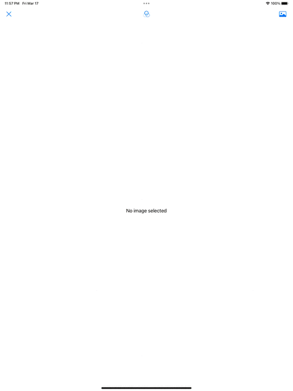

# CIMetalFilter
18-Mar-2023 Flock of swifts meetup example.
* Using `PhotosPicker` to load images from the photo library.
* Setting the orientation on a `UIImage`
* Translating between `Data`, `CIImage`, `CGImage`, `UIImage` and `SwiftUI.Image` 
* Creating `extern C` shader for CoreImage
* Creating a `CIFilter` from a `CIKernel`
* Reactively loading images and filter parameters from SwiftUI and transforming the inputs into a filtered image

